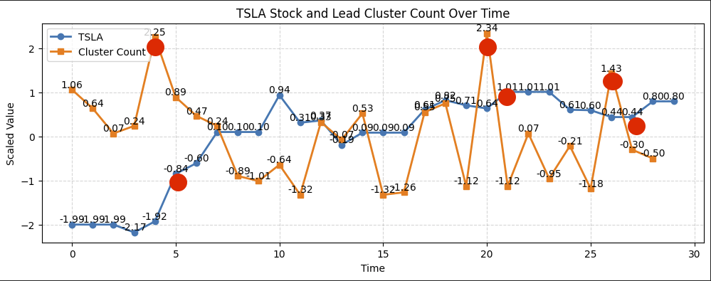

<h1>Election Week News & Stock Impact Analysis</h1>

In early November, the world witnessed a pivotal election day on November 5th, followed by a remarkable surge in stock prices on November 6th. This project investigates the dramatic correlation between news clusters and stock market movements, analyzing leading indicators and impact influence between news articles and market behavior.

<h2>Use Case Overview</h2>
<ul>
    <li><strong>Step 1:</strong> Gathered news articles from the <code>NYT API</code> for the month of November, focusing on the critical period around the election and subsequent market response.</li>
    <li><strong>Step 2:</strong> Evaluated the baseline cluster sizes and compared them with the largest clusters day-to-day to assess the impact on news trends and leading indicators. This included quantifying the influence percentage on cluster changes.</li>
    <li><strong>Step 3:</strong> Measured similarities between clusters to trace evolving narratives.</li>
    <li><strong>Step 4:</strong> Performed sentiment analysis on the lead clusters to contextualize the market's response to key narratives.</li>
</ul>

<h2>Technical Steps</h2>

Below are the key methodologies and technical processes used:

<ul>
    <li><strong>Stopword Removal:</strong> Customized stopword filtering to eliminate irrelevant words for better topic modeling.</li>
    <li><strong>Embeddings:</strong> Utilized sentence-transformer embeddings to represent news articles in high-dimensional vector space.</li>
    <li><strong>Dimensionality Reduction (UMAP):</strong> Applied <code>UMAP</code> (Uniform Manifold Approximation and Projection) to reduce vector dimensions while preserving structure for clustering.</li>
    <li><strong>Clustering (HDBSCAN):</strong> Used <code>HDBSCAN</code> (Hierarchical Density-Based Spatial Clustering of Applications with Noise) to identify news clusters with varying densities, ensuring noise points were excluded.</li>
    <li><strong>Topic Modeling:</strong> Extracted key topics from clusters using a count-based approach, and refined results using <code>key-bert</code> and Maximal Marginal Relevance (MMR) for better topic coherence.</li>
    <li><strong>Sentiment Analysis:</strong> Analyzed cluster sentiment using a transformer-based sentiment model to assess the emotional tone of representative news articles.</li>
</ul>

<h2>Output and Results</h2>
<ul>
    <li>Saved daily cluster comparisons, impact analyses, and sentiment summaries to <code>compare_daily_cluster.csv</code> for deeper analysis and visualization.</li>
    <li>Identified critical clusters influencing market behavior, highlighting the interplay between news narratives and stock trends.</li>
</ul>

